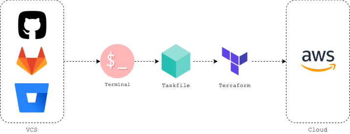

# Terraform Templates Base



**Mono Repo** Terraform Layout **[highly opinionated]**. Based on Vanilla Terraform, this layout used in Terminal or CI/CD operations, and Terraform Cloud.

```yaml
Alert!: There are quite few ways/tools to layout your Infrastructure as code. this is for plain vanilla Terraform.
```

## Overview

This repo contains several distinct folders each with specific purpose, and it expected to run in order.

### Recommended Layout

- **bootstrap**: contains Terraform bootstrap for:
  - **AWS** [option 1] (S3 bucket, KMS key and Dynamodb table for State files) - generate state file template for each environment.
  - **TFC** [option 2] (Terraform Cloud workspaces - Organization - environment variables) - generate state file template for each environment.
  - **Github** ( Repos - Access - Actions - Tokens) - generate two [minimum] repositories:
    - `iac-terraform-templates`
    - `iac-terraform-modules`
- **docs**: Documentations, screenshots and diagrams related files, alongside development workflow, includes `drawio` file.
- **stacks**: Terraform templates that define a working unit, consist of static and dynamic infrastructure, including:
  - `app` stack [dynamic] [target one or more account]: application related, mainly dynamic infrastructure.
  - `data` stack [static] [target one or more account]: databases, cache, s3 buckets, and data related.
  - `network` stack [static] [target one or more account]: networking, DNS, and VPN.
  - `mgmt` stack [static] [target one account]: management related, SSO.
  - `sec` stack [static] [target one account]: security related.
- **envs**: contains environments [dev-stage-prod][mgmt-sec] and regions including:
  - `region.tfvars` common environment values
  - `network.tfvars` network stack values
  - `data.tfvars` data stack values
  - `app.tfvars` app stack values
  - `network.hcl` network stack state file block
  - `data.hcl` data stack state file block
  - `app.hcl` app stack state file block
  - `.env` environment secrets and Cloud Access
- **Taskfile.yml**: `Taskfile` orchestrator for operations, includes other task files from `tasks` folder.
- **tasks**: Taskfile files - added as `submodule` from <https://github.com/mhmdio/iac-taskfile-framework>
- **CODEOWNERS**: Code owners for automate PR assignments.

---

## Order of development and deployment

1. **bootstrap**: creates backends, workspaces and repos
1. **envs/mgmt**: creates organization, accounts and SSO
1. **envs/ENV/REGION/network**: creates networking and VPN.
1. **envs/ENV/REGION/data**: creates databases, caches and S3 buckets.
1. **envs/ENV/REGION/app**: creates dynamic App Infra.

---

### Additional (optional) Layout

- **modules** [optional][use another monoRepo for modules]: custom Terraform modules folder, use public well-trusted modules, use <https://github.com/mhmdio/terraform-module-base> for module template.
- **config** [optional]: config files for all 3rd party tools that used with Terraform, and pipelines `CI/CD` samples files for automate Terraform Operations.
- **helm** [optional]: `helm` and `helmfile`.
- **serverless** [optional]: `Serverless` framework to manage *Dynamic infrastructure*
- **policies** [optional]: `OPA` policies.
- **tests** [optional]: test implementation using `LocalStack` and `conftest`
- **DevOps..sh** [optional]: `Bash` script orchestrator for operations.
- **Makefile** [optional]: `Makefile` orchestrator for operations, check <https://github.com/mhmdio/iac-makefile-framework> for more Make files.
- **Dockerfile** [optional]: `Dockerfile` to build an image with all tools needed for development.

---

## List of tools for AWS/Terraform Development environment requirements

- Taskfile
- Git
- Docker
- terraform
- terraform-docs
- terraform-lsp
- atlantis
- infracost
- inframap
- tflint
- driftctl
- tfsec
- checkov
- cloudrail
- KICS
- OPA
- kubectl
- helm
- helmfile
- awscli
- aws-vault
- direnv
- drawio
- VSCode
- Lens

---

## Related Repos

- <https://github.com/mhmdio/terraform-module-base>
- <https://github.com/mhmdio/iac-makefile-framework>
- <https://github.com/mhmdio/iac-taskfile-framework>
